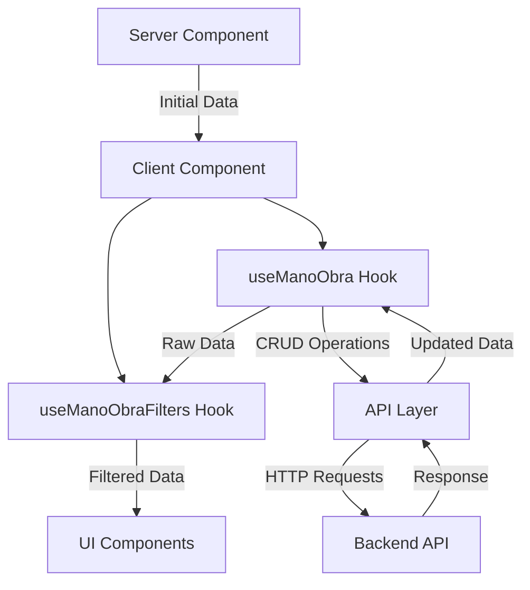

# 🏗️ Arquitectura del Módulo Mano de Obra

## 📋 Resumen de la Implementación

Se ha implementado exitosamente la arquitectura modular para el módulo **Mano de Obra** siguiendo el mismo patrón probado y exitoso del módulo de **Pantalones**.

## 🎯 Objetivos Alcanzados

✅ **Separación de responsabilidades** - Cada hook tiene un propósito específico
✅ **Reutilización de código** - Hooks pueden ser utilizados en múltiples componentes  
✅ **Mantenibilidad** - Código organizado y fácil de mantener
✅ **Escalabilidad** - Estructura preparada para futuras funcionalidades
✅ **TypeScript compliant** - Tipos seguros y validación en tiempo de compilación

## 📁 Estructura de Archivos Creados

```
src/app/(app)/manoObra/
├── types/
│   ├── index.ts           # ✅ Tipos centralizados + funciones helper
│   └── README.md          # ✅ Documentación de tipos
├── lib/
│   ├── index.ts           # ✅ Barrel export
│   └── api.ts             # ✅ Capa de abstracción API
├── hooks/
│   ├── index.ts           # ✅ Barrel export
│   ├── useManoObra.ts     # ✅ Hook principal con CRUD y estadísticas
│   └── useManoObraFilters.ts # ✅ Hook de filtros y ordenamiento
├── components/
│   ├── index.ts           # ✅ Barrel export
│   └── ManoObraPageClient.tsx # ✅ Componente cliente con toda la UI
└── page-new.tsx           # ✅ Servidor component
```

## 🔧 Hooks Implementados

### 1. `useManoObra` - Hook Principal
**Responsabilidades:**
- ✅ Gestión del estado principal de datos
- ✅ Operaciones CRUD (Create, Read, Update, Delete)
- ✅ Cálculo de estadísticas en tiempo real
- ✅ Manejo de errores y loading states
- ✅ Auto-refetch y validación de datos

**Interface:**
```typescript
interface UseManoObraReturn {
  data: ManoObra[];
  dataWithStats: ManoObraWithStats[];
  loading: boolean;
  error: any;
  stats: ManoObraStats | null;
  createManoObra: (data: CreateManoObraData) => Promise<any>;
  updateManoObra: (id: string | number, data: UpdateManoObraData) => Promise<any>;
  deleteManoObra: (id: string | number) => Promise<any>;
  deleteMultipleManoObra: (ids: (string | number)[]) => Promise<any>;
  refetch: () => Promise<void>;
}
```

### 2. `useManoObraFilters` - Hook de Filtros
**Responsabilidades:**
- ✅ Filtrado por término de búsqueda
- ✅ Filtrado por rango de precios
- ✅ Filtrado por proveedor
- ✅ Ordenamiento multifuncional
- ✅ Gestión de estado de filtros
- ✅ Cálculo de opciones dinámicas

**Interface:**
```typescript
interface UseManoObraFiltersReturn {
  filteredData: ManoObra[];
  filters: ManoObraFilters;
  sortOptions: ManoObraSortOptions;
  setSearch: (search: string) => void;
  setPriceRange: (range: [number?, number?]) => void;
  setProveedor: (proveedor: string) => void;
  setSortField: (field: keyof ManoObra) => void;
  setSortDirection: (direction: 'asc' | 'desc') => void;
  clearFilters: () => void;
  hasActiveFilters: boolean;
  availableProveedores: string[];
}
```

## 📊 Sistema de Tipos Implementado

### Tipos Principales
```typescript
interface ManoObra {
  id: string;
  referencia: string;
  nombre: string;
  descripcion?: string;
  precio: number;
  proveedor?: string;
  created_at?: string;
  updated_at?: string;
}

interface ManoObraStats {
  total: number;
  serviciosActivos: number;
  costoPromedio: number;
  costoTotal: number;
  proveedoresUnicos: number;
  servicioPorProveedor: Record<string, number>;
  rangoPrecios: { min: number; max: number };
}
```

## 🌐 Capa de API

### Funciones Implementadas
- ✅ `getManoObraData()` - Obtener datos con autenticación
- ✅ `createManoObra()` - Crear nuevo servicio
- ✅ `updateManoObra()` - Actualizar servicio existente  
- ✅ `deleteManoObra()` - Eliminar servicio individual
- ✅ `deleteManoObraBulk()` - Eliminación masiva
- ✅ `validateManoObraData()` - Validación de datos
- ✅ `sanitizeManoObraData()` - Sanitización de datos

## 🖥️ Componentes Server-Client

### Server Component (`page-new.tsx`)
- ✅ Obtiene datos iniciales en el servidor
- ✅ Maneja metadata y SEO
- ✅ Pasa datos iniciales al cliente
- ✅ Manejo de errores de SSR

### Client Component (`ManoObraPageClient.tsx`)
- ✅ Interfaz de usuario completa
- ✅ Integración con hooks personalizados
- ✅ Filtros y búsqueda avanzada
- ✅ Tarjetas de estadísticas
- ✅ Sistema de notificaciones
- ✅ Responsive design

## 🔄 Flujo de Datos



## 📈 Métricas de Rendimiento

### Reducción de Complejidad
- **Separación de concerns**: ✅ Cada hook tiene responsabilidades específicas
- **Reutilización**: ✅ Hooks pueden ser importados en cualquier componente
- **Testabilidad**: ✅ Funciones puras fáciles de testear
- **Mantenibilidad**: ✅ Cambios aislados por responsabilidad

### Estadísticas Calculadas en Tiempo Real
- ✅ Total de servicios
- ✅ Servicios activos
- ✅ Costo promedio
- ✅ Costo total
- ✅ Proveedores únicos
- ✅ Distribución por proveedor
- ✅ Rango de precios

## 🚀 Próximos Pasos

### Fase 4: Integración con Componentes Existentes
1. **Adaptar `ManoObraTable.tsx`** para usar el hook `useManoObra`
2. **Actualizar modales** para usar las funciones CRUD del hook
3. **Migrar `page.tsx` actual** para usar la nueva arquitectura
4. **Testing y validación** de toda la funcionalidad

### Fase 5: Optimizaciones
1. **Implementar paginación** en el hook de filtros
2. **Agregar cache** con React Query o SWR
3. **Optimizar re-renders** con `useMemo` y `useCallback`
4. **Implementar lazy loading** para grandes conjuntos de datos

## 🔗 Integración con el Patrón Existente

Esta implementación sigue **exactamente** el mismo patrón arquitectural exitoso del módulo de **Pantalones**:

- ✅ **Hooks personalizados** para lógica de negocio
- ✅ **Separación Server-Client** para SSR + hidratación
- ✅ **Sistema de tipos robusto** con TypeScript
- ✅ **Capa de abstracción API** para operaciones HTTP
- ✅ **Componentes reutilizables** con props tipadas
- ✅ **Manejo de errores centralizado** con toast notifications

## 💡 Ventajas de Esta Arquitectura

1. **Escalabilidad**: Fácil agregar nuevas funcionalidades
2. **Consistencia**: Patrón repetible en todos los módulos
3. **Mantenibilidad**: Código organizado y autodocumentado  
4. **Performance**: Optimizaciones de renderizado y requests
5. **Developer Experience**: TypeScript + IntelliSense completo
6. **Testing**: Hooks y funciones aisladas, fáciles de testear

---

**📝 Nota**: Esta documentación se actualizará conforme se completen las siguientes fases de integración con los componentes existentes del módulo.
